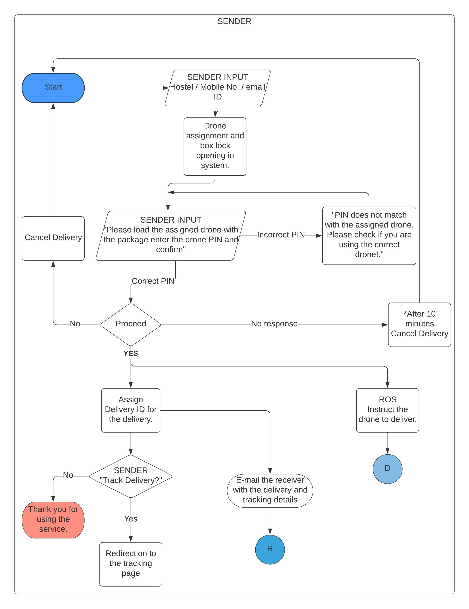
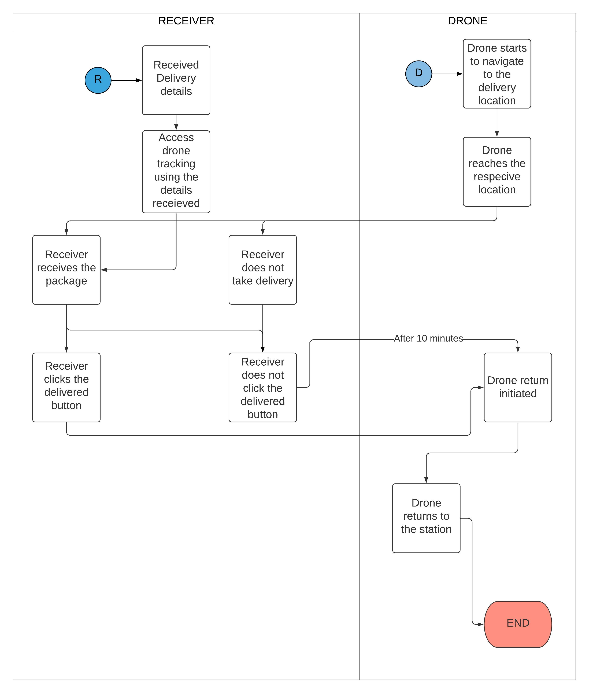

# ITSP-Drone_Delivery

*This report contains the code behind a **Drone Delivery system** innovated in fulfilment of the Institute Technical Summer Project organised by the Institute Technical Council of IIT Bombay.*
## Aim Of The Project
* Creating a complete Drone Delivery system which can be deployed.
*Currently the system only caters to the IIT Bombay campus but there are plans to scale it to larger areas in future.*
* Development of a website which can be used to initiate deliveries and track them.
* Integrating the input from website with the drone network and give corresponding instruction to the drone.
## Structure Of Repository
* The Drone system is present in the Drone folder.
* The Website codebase in present in the website folder.
* The world folder has a approximate 3-D model of the Indian Institute Of Technology Bombay campus.
*The other folders are not of much importance*
## System
*Below is a basic schematic of our system*



 ## Simulated Drone system:
 1. Clone the repository.
 ```
 git clone https://github.com/ShubhamGupta15/ITSP-Drone_Delivery.git
 ```
 2. To install ROS, Gazebo, mavros, mavlink run the script ubuntu_sim_ros_melodic.sh.
 ```
 cd  ./ITSP-Drone_Delivery
 bash ubuntu_sim_ros_melodic.sh 
 ```
 3. Clone px4 Firmware in catkin_ws/src using 
 ```
 cd ~/catkin_ws/src
 git clone https://github.com/PX4/Firmware.git --recursive.
 ```
 4. Install rosbridge_suite from http://wiki.ros.org/rosbridge_suite.
 5. Add a folder named offb in catkin_ws/src.
 ```
 mkdir ~/catkin_ws/src/offb
 ```
 6. Replace the contents of your offb package with the contents of this offb-single vehicle for single drone system and with offb-multi vehicle for multi drone system..
 7. Copy the launch_rosbridge.sh launch-common.sh and launch-offb.sh in the ROS folder to your catkin_ws root.
 ```
 cd ~/catkin_ws
 cp launch_rosbridge.sh launch-common.sh launch-offb.sh 
 ```
 8. Check and modify permisson of all files to executables.
 ```
 chmod +x launch_rosbridge.sh
 chmod +x launch-common.sh
 chmod +x launch-offb.sh
 ```
 9. From the worlds folder, add all the contents to both catkin_ws/src/Firmware/Tools/sitl_gazebo/worlds, and sitl_gazebo/models.
 10. At the end of the line 8 change the world file to iitb2.world from empty.world
 ````
 cd ~/catkin_ws/src/Firmware/launch
 gedit multi_uav_mavros_sitl.launch
 ```` 
 11. Run catkin build. (not catkin_make)
 ```
 cd ~/catkin_ws
 catkin build
 ```
 12. Install QGroundControl.
 13. Setup Done!!

## WEbsite Setup
The website is based a Django backend along with fontend using HTML,CSS and Javascript.
To see how the setup works see [here](./Website/Backend_Instructions.md)
## How to run simulation:
1. First launch the rosbridge server using the launch_rosbridge.sh.
```
cd ~/catkin_ws
./launch_rosbridge.sh
```
2. In a new terminal launch the ROS setup using launch-offb.sh
```
./launch-offb.sh
```
3. Run QGroundControl.
4. Start a Django sever in another terminal. Type the IP 127.0.0.1:8080 in the browser. This will take you to the home page. 
5. Fill the delivery form and submit.
6. The simulation and the QGroundControl will recieve commands and the misson will run.

Here is an example of our system running:
https://drive.google.com/file/d/15LzuOwKoyH1I0P72AiTNuyBkBPTJ-sk4/view?usp=sharing
## Disclaimer
Fair use of ubuntu_sim_ros_melodic.sh from dev.px4.io
